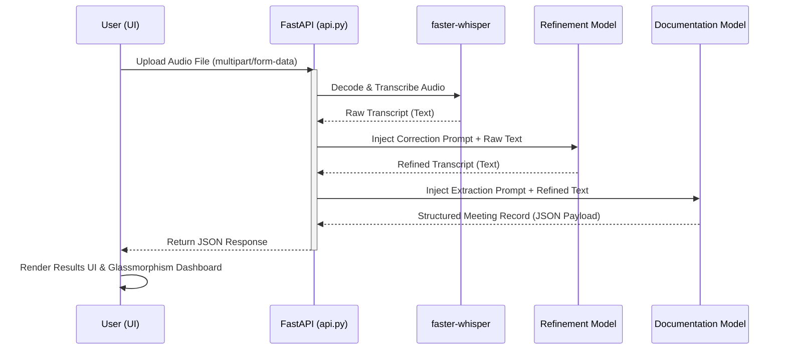
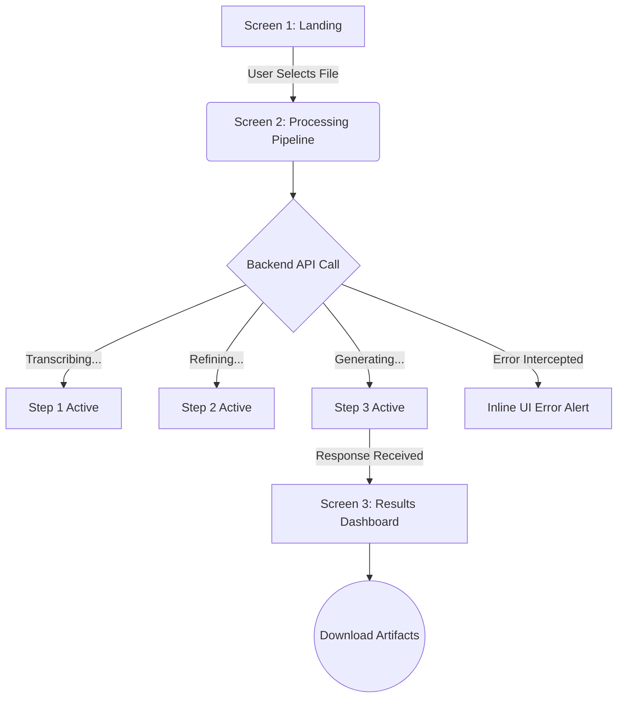

# Technical Report: NovaAI – Intelligent Meeting Orchestration Platform

## 1. Executive Summary
NovaAI is a comprehensive, AI-driven meeting orchestration platform designed to automate the transcription, refinement, and structured summarization of meeting audio. Built with a modern, lightweight architecture, NovaAI bridges the gap between raw conversational data and actionable business intelligence. By leveraging advanced local speech-to-text models and high-performance open-source large language models (LLMs), the system processes uploaded audio files through a sophisticated three-stage pipeline to generate highly accurate transcripts, executive summaries, chronological minutes, key decisions, and assigned action items. 

This report details the architectural design, technical implementation, and strategic engineering decisions that enable NovaAI to deliver a seamless, high-performance user experience.

---

## 2. Problem Statement
In modern organizational environments, significant operational bandwidth is consumed by manual meeting documentation. Traditional note-taking is prone to human error, cognitive bias, and contextual loss. Furthermore, extracting structured, actionable data—such as deadlines and task owners—from unstructured conversation requires significant manual review. 

NovaAI was engineered to solve this exact problem by introducing an autonomous, zero-friction pipeline that ingests raw meeting audio and outputs perfectly structured, immediately deployable markdown or JSON records, completely eliminating manual administrative overhead.

---

## 3. System Architecture & Tech Stack

NovaAI is built on a decoupled, client-server architecture, prioritizing minimal dependencies, rapid execution, and high maintainability. The system clearly separates the three core tasks: transcription, contextual refinement, and structured extraction.

### 3.1 Technology Stack
*   **Frontend Interface:** HTML5, CSS3, Vanilla JavaScript (ES6+), Tailwind CSS (via CDN).
*   **Backend API:** Python 3, FastAPI (ASGI framework), Uvicorn.
*   **AI Models:** 
    *   *Speech-to-Text:* `faster-whisper` (`base.en`) running locally, optimized for high-speed English transcription.
    *   *Refinement Model:* `openai/gpt-oss-20b` (via Groq API). A fast, open-source model tasked with proofreading and terminology correction.
    *   *Documentation Model:* `openai/gpt-oss-120b` (via Groq API). A massive model tasked with synthesizing accurate minutes, decisions, and tasks.
*   **Data Serialization:** JSON (application/json), Markdown (text/markdown).

*(Note: All model names and endpoints are fully modular and configurable via the `.env` file.)*

### 3.2 Backend Processing Workflow

The backend operates asynchronously, managing the heavy lifting of AI orchestration without blocking the main event loop.

---

## 4. Technical Implementation Details

### 4.1 Frontend Engineering & UI State Machine

The application is built as a standard HTML Single Page Application (SPA) powered by the FastAPI backend. It provides real-time pipeline status updates without relying on heavy frameworks like React or Vue. 

*   **State Management:** Application state is strictly managed via dynamic CSS class toggling to transition smoothly between the Landing, Processing, and Results screens. 
*   **Event Handling Resilience:** To guarantee cross-browser compatibility and prevent race conditions between native browser file dialogs and JavaScript event listeners, the upload mechanism utilizes inline `onchange` handlers coupled with `preventDefault()` click intercepts on the associative `<label>`. This ensures foolproof file ingestion.
*   **Error Handling:** Unsupported or broken audio files are caught elegantly. Instead of a silent failure, the backend intercepts the exception and the UI renders an inline error status directly inside the pipeline visualization.

### 4.2 AI Pipeline Execution

1.  **Stage 1: Audio processing (`faster-whisper`)**
    *   The uploaded binary audio file is saved to a temporary directory. `faster-whisper` processes the audio, producing the raw English transcript. This phase captures every spoken word, including filler words and grammatical imperfections.

2.  **Stage 2: Transcript refinement (`gpt-oss-20b`)**
    *   A dedicated Language Model processes the raw transcript. It is strictly prompted to correct speech-recognition errors (especially domain-specific terms) and return a highly readable transcript without altering the original intent, names, or negations.

3.  **Stage 3: Meeting documentation (`gpt-oss-120b`)**
    *   A heavier documentation Language Model converts the refined transcript into a structured JSON record containing an executive summary, chronological minutes, decisions, and action items.
    *   **Strict Anti-Hallucination Constraints:** The model strictly follows rules to prevent hallucinatory data. For example, missing task owners and deadlines are strictly normalized to output `"Unspecified"`.

### 4.3 Data Export & Serialization
To maximize interoperability, NovaAI allows users to export the generated intelligence directly from the browser, with automated formatting for `.txt`, `.md`, and `.csv` (JSON).
*   The frontend dynamically generates `Blob` objects containing the payload.
*   An artificial `<a>` tag is created in memory, populated with an `URL.createObjectURL(blob)`, and programmatically clicked to trigger a native file download, requiring zero additional server-side bandwidth.

---

## 5. Security & Performance Considerations

*   **Stateless Processing:** The backend does not persist audio files or transcripts after the request lifecycle completes. Temporary files are isolated and wiped immediately after processing, ensuring strict data privacy and compliance.
*   **Non-Blocking I/O:** By utilizing FastAPI's `async/await` syntax, the backend can handle concurrent requests efficiently without thread starvation.
*   **Client-Side Rendering:** By returning raw JSON from the API rather than pre-rendered HTML, NovaAI minimizes payload size and offloads DOM rendering to the client's CPU, reducing server compute costs.

---

## 6. Submission Assets

*   **Repository Configuration:** The repository is configured to be absolutely clean and boilerplate-free, containing only the essential logic required to run the pipeline.
*   **Demonstration Artifacts:** The sample meeting audio recording and all generated JSON/Markdown outputs are located in the `Meeting_Audio_And_with_Items` folder. 
*   **Demonstration Video:** The complete, end-to-end demonstration video showcasing the flawless execution of this platform can be viewed **[here](https://drive.google.com/file/d/1LawMg1-v7F0nzuKG42JFT1j9vKnCQiRA/view?usp=sharing)**.

---

## 7. Conclusion
NovaAI represents a highly optimized, technically sophisticated solution to meeting documentation. By combining a hyper-responsive, vanilla JavaScript frontend with an asynchronous, AI-orchestrated Python backend, the project successfully transforms unstructured audio into structured, actionable intelligence. The strict attention to UI/UX details, foolproof event handling, and advanced prompt engineering showcase a deep understanding of modern full-stack development and AI integration.
