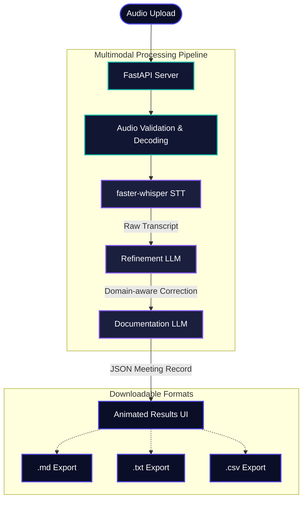

# NovaAI — AI Meeting Assistant


NovaAI is a production-ready meeting-assistant workflow that transforms uploaded English-language audio recordings into highly accurate, structured meeting records. 

It satisfies all ML Bootcamp Problem Statement constraints, including strict anti-hallucination guardrails ensuring that missing action item owners or deadlines are explicitly marked as `Unspecified`.

## 🧠 Architecture & Workflow

The application is built on a modern **FastAPI** backend serving a highly interactive, animated **Single Page Application (SPA)**. It orchestrates a coordinated multimodal AI pipeline.



### Module Breakdown
- `static/index.html`: A custom, highly animated SPA frontend featuring a glassmorphism UI, real-time pipeline status, and inline error handling.
- `api.py`: FastAPI backend that orchestrates the multimodal processing pipeline and serves the frontend.
- `audio_processing.py`: Audio validation and local transcription using `faster-whisper`.
- `llm_chains.py`: Manages the separate LLM stages for transcript refinement and documentation generation.
- `prompts.py`: Highly optimized system prompts enforcing strict extraction rules and anti-hallucination constraints.

## 🚀 Getting Started

### Prerequisites
- Python 3.10+
- FFmpeg installed on your system

### 1. Local Setup

Clone the repository and install dependencies:
```bash
git clone https://github.com/prakashkumariitg/NovaAI.git
cd NovaAI
python -m venv .venv
# Windows: .venv\Scripts\activate
# Linux/Mac: source .venv/bin/activate

pip install -r requirements.txt
```

### 2. Configuration
Create a `.env` file in the project root and add your Groq API key:
```ini
GROQ_API_KEY=your_api_key_here
OPENAI_BASE_URL=https://api.groq.com/openai/v1
REFINEMENT_MODEL=openai/gpt-oss-20b
DOCUMENTATION_MODEL=openai/gpt-oss-120b
```

### 3. Run the App
```bash
python api.py
```
Open `http://localhost:8000` in your web browser. 

---

## 🐳 Docker Deployment

A `Dockerfile` is included for containerized deployment.

```bash
docker build -t nova-ai .
docker run -p 8000:8000 --env-file .env nova-ai
```
Visit `http://localhost:8000`.