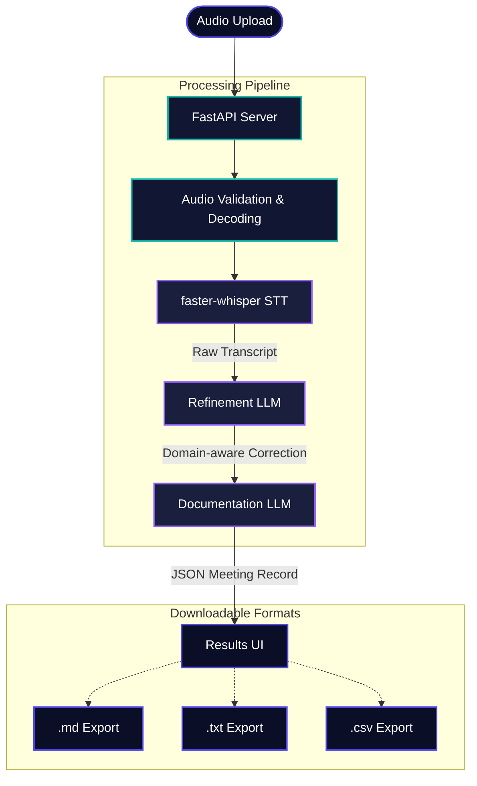

# NovaAI - AI Meeting Assistant


NovaAI is an end-to-end meeting assistant that takes uploaded audio recordings and converts them into accurate, structured meeting records. 

It covers all ML Bootcamp Problem Statement constraints, including strict rules that force the model to output `Unspecified` whenever action item owners or deadlines are missing.

## Demonstration Video
**[Click here to watch the full end-to-end demonstration video](https://drive.google.com/file/d/1HzktXo8VJhSuJ44VvV3o9ZObw6YqjPCl/view?usp=sharing)**

---

## System Architecture & Workflow

The backend uses **FastAPI** to connect the audio processing directly to the frontend interface. It runs a 3-stage AI pipeline.



### Processing Workflow
1. **Audio processing:** The uploaded recording is validated and processed locally. `faster-whisper` transcribes the audio to produce the raw transcript.
2. **Transcript refinement:** A dedicated LLM proofreads the raw transcript, correcting speech-recognition errors (like domain-specific terms) and returning a clean transcript without changing the original meaning.
3. **Meeting documentation:** A second, larger LLM reads the refined transcript and extracts a structured JSON record containing an executive summary, chronological minutes, decisions, and action items.

### Models Utilized
- **Speech-to-Text Model:** `faster-whisper` (`base.en`). Runs locally for fast transcription.
- **Transcript Refinement Model:** `openai/gpt-oss-20b` (via Groq API). A fast open-source model used to fix terminology while strictly preserving intent and names.
- **Meeting Documentation Model:** `openai/gpt-oss-120b` (via Groq API). A larger model used for deep semantic extraction. It synthesizes the minutes and decisions, following strict rules to avoid hallucinations (like outputting `Unspecified` for missing deadlines).

*Note: Model names and endpoints are configurable via the `.env` file.*

## Module Breakdown
- `static/index.html`: The HTML frontend that shows the pipeline status and results.
- `api.py`: FastAPI backend that connects the frontend to the pipeline.
- `audio_processing.py`: Audio validation and local transcription logic.
- `llm_chains.py`: Manages the prompts and API calls for the two LLM stages.
- `prompts.py`: The system prompts that enforce the extraction rules.

## Getting Started

### Prerequisites
- Python 3.10+
- FFmpeg installed on your system

### 1. Local Setup
Clone the repository and install dependencies:
```bash
git clone https://github.com/prakashkumariitg/NovaAI.git
cd NovaAI
python -m venv .venv
# Windows: .venv\Scripts\activate
# Linux/Mac: source .venv/bin/activate

pip install -r requirements.txt
```

### 2. Configuration
Create a `.env` file in the project root and add your Groq API key:
```ini
GROQ_API_KEY=your_api_key_here
OPENAI_BASE_URL=https://api.groq.com/openai/v1
REFINEMENT_MODEL=openai/gpt-oss-20b
DOCUMENTATION_MODEL=openai/gpt-oss-120b
```

### 3. Run the App
```bash
python api.py
```
Open `http://localhost:8000` in your web browser. 

---

## Docker Deployment

A `Dockerfile` is included for containerized deployment.
```bash
docker build -t nova-ai .
docker run -p 8000:8000 --env-file .env nova-ai
```
Visit `http://localhost:8000`.

## Submission Assets
The sample meeting audio recording and all generated JSON/Markdown outputs are located in the `Meeting_Audio_And_with_Items` folder.
