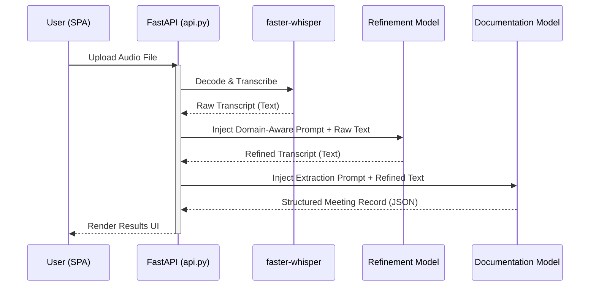

# Technical Description

## System Architecture

NovaAI implements a robust, multimodal pipeline managed by a FastAPI backend. The system ensures distinct processing boundaries between transcription, refinement, and analytical extraction.

## Ordered Processing Workflow

1. **Audio processing:** The uploaded recording is validated and processed locally. `faster-whisper` (`base.en` by default) transcribes the audio, producing the raw English transcript.
2. **Transcript refinement:** A dedicated Language Model processes the raw transcript, correcting speech-recognition errors (especially domain-specific terms and acronyms) and returning a clean, highly readable transcript without altering the original meaning.
3. **Meeting documentation:** A separate, more capable documentation Language Model converts the refined transcript into a highly structured JSON record containing an executive summary, chronological minutes, explicit decisions, and concrete action items.

## Models Utilized

- **Speech-to-Text Model:** `faster-whisper` (`base.en`). Runs locally and is optimized for English transcription speed and accuracy.
- **Transcript Refinement Model:** `openai/gpt-oss-20b` (via Groq API). A fast, highly capable open-source model tasked specifically with proofreading and terminology correction while strictly preserving intent, names, numbers, and negations.
- **Meeting Documentation Model:** `openai/gpt-oss-120b` (via Groq API). A powerful, high-parameter model tasked with deep semantic extraction. It synthesizes accurate minutes, decisions, and tasks, strictly following anti-hallucination guardrails (e.g., outputting `Unspecified` for missing owners/deadlines).

*All model names and endpoints are fully configurable via the `.env` file.*

## Interface and Output Handling

The application is built on a highly interactive, animated HTML Single Page Application (SPA) powered by a FastAPI backend. It provides real-time pipeline status updates and beautiful visualizations.

The interface allows one-click downloads for all generated artifacts, with adaptive formatting for `.txt`, `.md`, and `.csv`. Missing task owners and deadlines are strictly normalized to `Unspecified`. 

**Error Handling:** Unsupported or broken audio files are elegantly caught. Instead of a silent failure, the backend intercepts the exception and the UI renders a clear, inline error status directly inside the pipeline visualization.

## Submission assets

Sample recordings, generated sample outputs, and a demo video should be added to the repository root when preparing the final submission zip.
